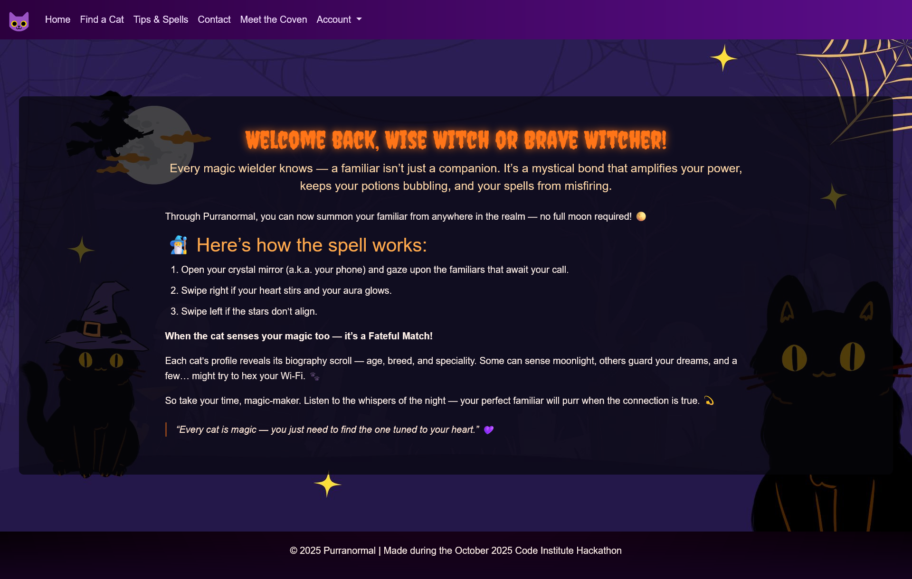
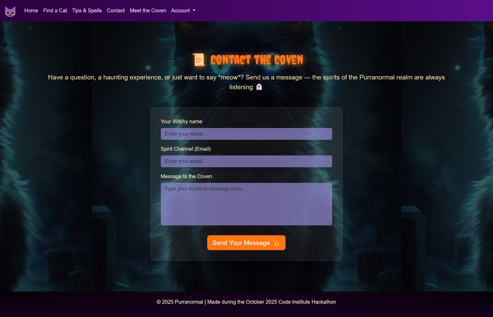

# CI-Halloween-Hackathon-25 

## Introduction
Welcome to **Purranormal**!

 A spooky-themed hackathon project where we aim to find the *purr*-fect feline familiar for witches and spellcasters alike. Explore our unique selection of mystical cats, each with their own traits and personalities. Whether you're a seasoned witch or a budding sorcerer, Purranormal is here to help you discover your next magical companion.

## Table of Contents
- [Wireframes](#wireframes)
- [User Stories](#user-stories)
- [Technologies Used](#technologies-used)
- [Features](#features)
- [Credits](#credits)
- [Deployment Instructions](#deployment-instructions)
- [Meet the team](#meet-the-team)
- [Acknowledgements](#acknowledgements)

## Wireframes
Below is the main wireframe for Purranormal — This sketch gently maps out the layout we imagined for the main app page.

Figure: Wireframe showing layout, primary navigation and the placement of the main cat-matching cards.

## User Stories
- As a **user**, I can access the home page to learn about the Purranormal platform and its purpose.
- As a **user**, I want clear and intuative navigation so I can easily find what I am looking for.
- As a **user**, I can swipe left or right on a cat's profile to indicate interest in adopting a cat.
- As a **user**, I can register and log in to an account so I can manage my cat adoptions.
- As a **user**, I can save cat profiles to my account so I can find them later.
- As a **user**, I want the site to be responsive so that I can easily access the app on all devices.
- As a **site admin**, I can add, edit, or remove cat profiles from the platform to keep the listings up to date.
- As a **site admin**, I can to approve or review adoption requests so that each familiar is matched with a suitable user.
- As a **site admin**, I want to ensure the site performs well across all devices so that users have a consistent experience.

## Technologies Used
- HTML:
- CSS:
- JavaScript:
- Python:
- Django:
- Django Admin:

## Features

### Navigation Bar
The navigation bar is present on all pages, providing easy access to the main sections of the site: Home, Meet the Coven, Find a Cat, Tips & Spells, and Contact. It also includes login and registration links for user accounts.

---

### Home Page
Introduces users to Purranormal. Highlights the themes and purpose of the platform. Includes Links to the app page and tips & spells page for quick navigation.

---

### Meet the Coven Page
Displays the team behind the project, their roles, and their contributions. Also includes LinkedIn and GitHub links for each team member.

---

### Find a Cat Page
Allows users to browse available cat profiles. Each profile includes image, name, traits and description of the the cat.

---

### Tips & Spells Page
Contains instructions on how to use the app.

---

### Contact Page
Provides a form for users to reach out with questions or feedback.

---

### Account Login/Registration
Enables users to create an account or log in to manage their cat adoptions.

## Credits 

### Content
- Generative AI tools were used in various parts of this project.

### Media

## Deployment Instructions

Deployment instructions for Heroku: 

Go to Heroku.com and implement the following steps in this order:

1. On the home page, click 'New' and in the dropdown, click on 'Create a new app'.
2. Add app name (This name must be unique, and have all lower case letters. Also use minus/dash signs instead of spaces.)
3. Select Region (Select the most relevant region, mine is Europe)
4. Click the button that says 'Create App'.
5. Click on the Deploy tab near the top of the screen.
6. Where is says Deployment Method click on Github.
7. Below that, search for your repo name and add that.
8. Click connect to the app.

Before clicking below on enable automatic deployment do the following:

1. Click on the settings tab
2. Click on reveal config vars.
3. Add in your variables from your env. files as key value pairs. 
4. Go back and click on the Deploy tab.

Before the app can be connected, push the following new files below to the repository. Go back in the terminal in your coding environment and add the following:

1. git status
2. git add requirements.txt
3. git commit -m "Add requirements.txt file"
4. git add Procfile (web: gunicorn adoptioncat.wsgi:application)
5. git commit -m "Add Procfile"
6. git push

Head back over to Heroku where the Deploy tab is.

1. Click 'Enable Automatic Deploys'
2. Click Deploy Branch. (Should be a main or master branch)
Heroku will receive code from Github and build app with the required packages. Hopefully once done the 'App has successfully been deployed message below' will appear. 
3. Click 'View' to launch the new app. 
The deployed link of the app is https://purranormal-26af1e8cdfe0.herokuapp.com/

## Meet the team
We are Codebusters, the team behind Purranormal:
- Hannah Olbrich - Scrum Master, Agile
- Dion - App functionality, Visual Design/Artist
- Aleksandra - Frontend Developer
- Magdalena - Authentication
- Taiwo - Frontend Developer
- Fanxiang Meng - Documentation

## Acknowledgements
- A big thank you to the Code Institute team and hackathon organisers for their continuous support and guidance throughout this project.
---
