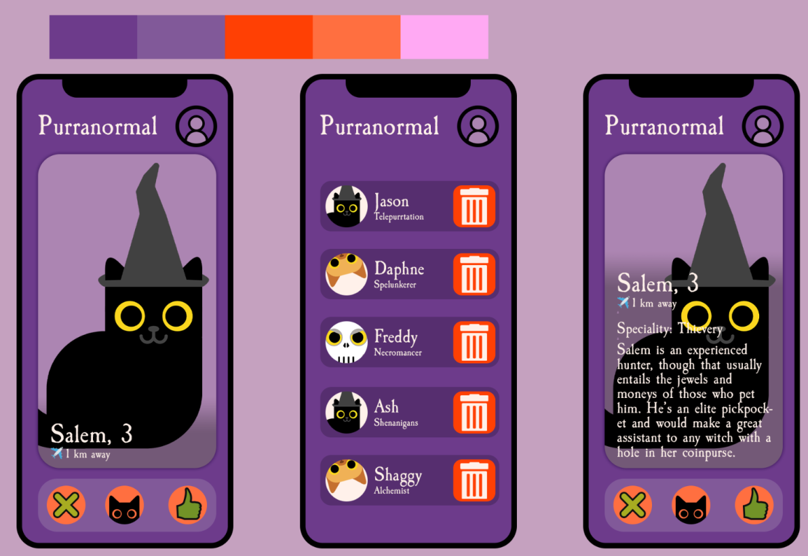
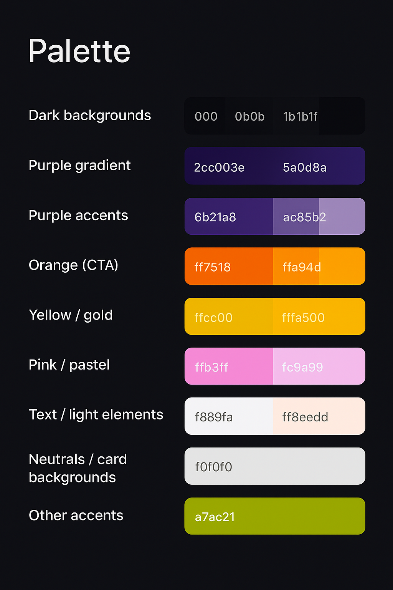

# CI-Halloween-Hackathon-25 

## Introduction
Welcome to **Purranormal**!

 A spooky-themed hackathon project where we aim to find the *purr*-fect feline familiar for witches and spellcasters alike. Explore our unique selection of mystical cats, each with their own traits and personalities. Whether you're a seasoned witch or a budding sorcerer, Purranormal is here to help you discover your next magical companion.

## Wireframes
Below is the main wireframe for Purranormal — This sketch gently maps out the layout we imagined for the main app page.

Figure: Wireframe showing layout, primary navigation and the placement of the main cat-matching cards.

## User Stories
- As a **user**, I can access the home page to learn about the Purranormal platform and its purpose.
- As a **user**, I want clear and intuative navigation so I can easily find what I am looking for.
- As a **user**, I can swipe left or right on a cat's profile to indicate interest in adopting a cat.
- As a **user**, I can register and log in to an account so I can manage my cat adoptions.
- As a **user**, I can save cat profiles to my account so I can find them later.
- As a **user**, I want the site to be responsive so that I can easily access the app on all devices.
- As a **site admin**, I can add, edit, or remove cat profiles from the platform to keep the listings up to date.
- As a **site admin**, I can to approve or review adoption requests so that each familiar is matched with a suitable user.
- As a **site admin**, I want to ensure the site performs well across all devices so that users have a consistent experience.

## Technologies Used
- HTML:
- CSS:
- JavaScript:
- Python:
- Django:
- Django Admin:

## Design choices

This project includes several intentional design choices made to balance speed of development, accessibility, and a strong thematic visual identity:

- Tech stack: built with Django to prioritise rapid development and easy deployment for a hackathon/demo environment. Django's admin speeds up content management.
- User experience: a mobile-first, responsive layout with card-based cat profiles and clear calls-to-action to simplify adoption flows and make interaction intuitive on touch devices.
- Visual design: a dark, purple-themed aesthetic chosen to reinforce the spooky/halloween brand while using high-contrast text and clear visual hierarchy for readability.
- Accessibility: semantic HTML, descriptive alt text for images, and attention to contrast and touch target size to help users with different needs.
- Static assets: images, CSS, and audio are served from the `static/` folder to keep the deployment straightforward; media usage was kept limited for faster builds.
- Testing & maintainability: the focus was on core user journeys for the hackathon. 

## Colour palette
The colour palette used in this project (hex values) with brief notes on usage:

- Dark backgrounds: `#000`, `#0b0b0d`, `#1b1b1f`, `#1a001a` — main page backgrounds and hero gradients.
- Purple gradient: `#2c003e` → `#5a0d8a` — hero / header backgrounds.
- Purple accents: `#6b21a8`, `#ac85b2`, `#cab2d6` — accents, links and decorative elements.
- Orange (CTA): `#ff7518`, `#ffa94d`, `#ff7f00` — call-to-action buttons, borders, highlights.
- Yellow / gold: `#ffcc00`, `#ffa500`, `#fdbe70` — shadows and highlights.
- Pink / pastel: `#ffb3ff`, `#fc9a99`, `#f5e1ff` — decorative accents.
- Text / light elements: `#f8f9fa`, `#f8eedd`, `#fff1ea` — primary text and light UI elements.
- Neutrals / card backgrounds: `#f0f0f0` — card and panel backgrounds.
- Other accents: `#a7ac21` — small green accents used in some components.

Below is the visual palette used in the project:

## Features

## Future features

As a team, we plan to continue developing the app beyond its initial demo scope. Our goal is to enhance usability, engagement, and magical matchmaking through the following features:

- **Search & filters** – Add a search bar and filters (age, speciality, distance, availability) to help users find suitable cats quickly.
- **Saved favourites & history** – Allow users to bookmark cat profiles and revisit previous matches or interactions.
- **Notifications & reminders** – Implement push/email notifications for new matches, updates, or seasonal rituals.

## Credits
- Background image created using [Canva](https://www.canva.com/) — used for visual consistency and thematic styling.
### Content
- Generative AI tools were used in various parts of this project.

### Media

## Deployment Instructions

Deployment instructions for Heroku: 

Go to Heroku.com and implement the following steps in this order:

1. On the home page, click 'New' and in the dropdown, click on 'Create a new app'.
2. Add app name (This name must be unique, and have all lower case letters. Also use minus/dash signs instead of spaces.)
3. Select Region (Select the most relevant region, mine is Europe)
4. Click the button that says 'Create App'.
5. Click on the Deploy tab near the top of the screen.
6. Where is says Deployment Method click on Github.
7. Below that, search for your repo name and add that.
8. Click connect to the app.

Before clicking below on enable automatic deployment do the following:

1. Click on the settings tab
2. Click on reveal config vars.
3. Add in your variables from your env. files as key value pairs. 
4. Go back and click on the Deploy tab.

Before the app can be connected, push the following new files below to the repository. Go back in the terminal in your coding environment and add the following:

1. git status
2. git add requirements.txt
3. git commit -m "Add requirements.txt file"
4. git add Procfile (web: gunicorn adoptioncat.wsgi:application)
5. git commit -m "Add Procfile"
6. git push

Head back over to Heroku where the Deploy tab is.

1. Click 'Enable Automatic Deploys'
2. Click Deploy Branch. (Should be a main or master branch)
Heroku will receive code from Github and build app with the required packages. Hopefully once done the 'App has successfully been deployed message below' will appear. 
3. Click 'View' to launch the new app. 
The deployed link of the app is https://purranormal-26af1e8cdfe0.herokuapp.com/

## Meet the team
We are Codebusters, the team behind Purranormal:
- Hannah Olbrich - Scrum Master, Agile
- Dion 
- Aleksandra
- Magdalena
- Taiwo
- Fanxiang Meng

## Acknowledgements
- A big thank you to the Code Institute team and hackathon organisers for their continuous support and guidance throughout this project.
---
